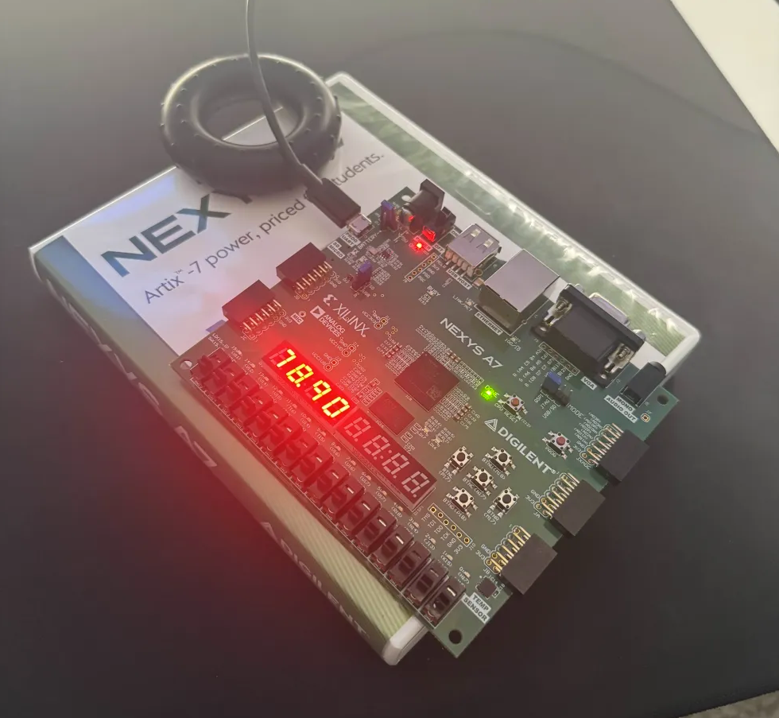

# I2C Temperature Sensor on Nexys A7-100T

## Photo of it running

## Description
This project implements an I2C master in SystemVerilog on an FPGA to interface with a digital temperature sensor. Specifically, the ADT7420 which comes built into the Nexys A7. 
It includes custom **I2C transmit/receive modules**, a **finite state machine (FSM) controller**, and real-time data acquisition/visualization.
It should be drag and drop if all you want is to make your FPGA board display the temperature in Fahrenheit for the area around the sensor.
Note: **This project does continuously ask and display temperature readings**

## How It Works
1. The **I2C master FSM** generates START, STOP, and data transfer sequences.
2. The **TX module** shifts out bytes and waits for ACKs from the slave.
3. The **RX module** receives data bytes and issues ACK/NACK.
4. Temperature values are captured, stored, and output for visualization on the seven segment display.

